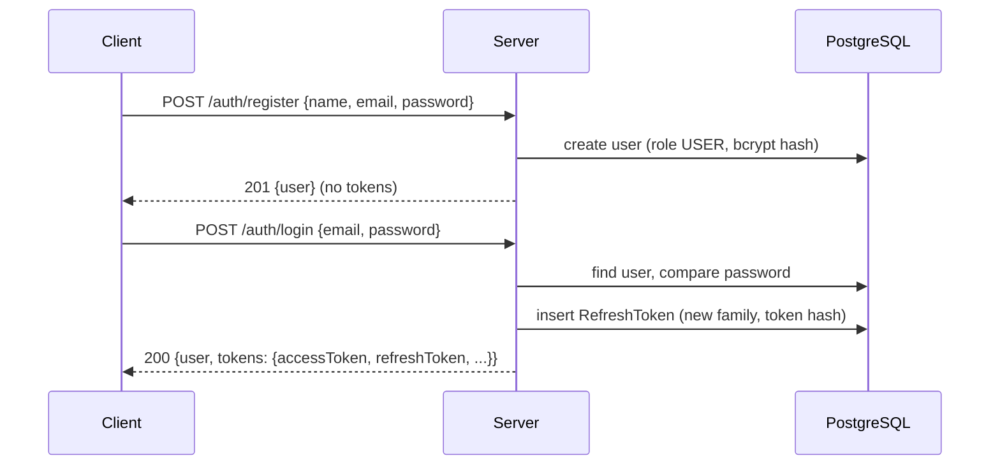
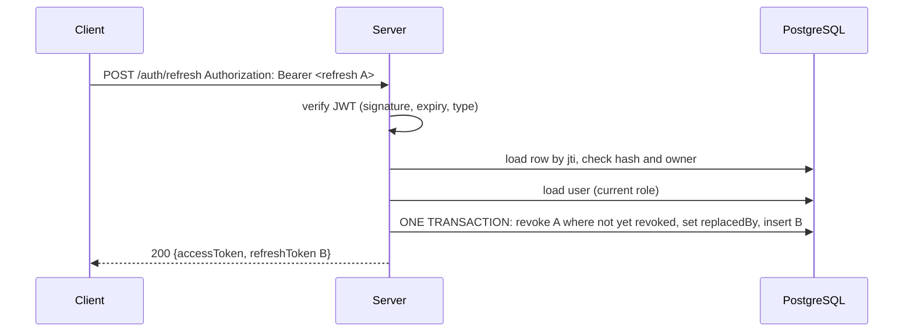

# Authentication & Authorisation

Official documentation for the authentication and authorisation feature of `backend-demo`: user registration and login, access and refresh tokens, refresh-token rotation, logout, and role-based access control.

- **Specification:** [`docs/feature-contracts/20261001073651-authentication-authorization.md`](../docs/feature-contracts/20261001073651-authentication-authorization.md) is the agreed feature contract this implementation follows. This document describes what was built and how to use and operate it.
- **Status:** implemented. The authentication tests are 115 of the project's 232; the rest cover [Organizations & Membership](organizations.md), which builds on this feature without changing it.

## Contents

1. [Overview](#1-overview)
2. [Architecture](#2-architecture)
3. [Data model](#3-data-model)
4. [Tokens](#4-tokens)
5. [Flows](#5-flows)
6. [API reference](#6-api-reference)
7. [Error codes](#7-error-codes)
8. [Security model and known limits](#8-security-model-and-known-limits)
9. [Configuration](#9-configuration)
10. [Database migrations and seeds](#10-database-migrations-and-seeds)
11. [Running, building and testing](#11-running-building-and-testing)
12. [Client integration guide](#12-client-integration-guide)
13. [Logging](#13-logging)
14. [Extending and replacing parts](#14-extending-and-replacing-parts)

---

## 1. Overview

| Capability | Summary |
|---|---|
| Registration and login | Email + password. Passwords are hashed with bcrypt (cost 12). |
| Access token | Short-lived (15 min) JWT sent as `Authorization: Bearer <token>` on every protected request. Verified without a database lookup. |
| Refresh token | Long-lived (30 days) JWT used only to obtain a new token pair. Tracked server-side so it can be rotated and revoked. |
| Refresh-token rotation | Every refresh returns a **new** refresh token and permanently retires the old one. |
| Reuse detection | Presenting an already-rotated refresh token revokes the whole session (token family). |
| Logout | Revokes the session's refresh tokens. |
| Role-based authorisation | Two roles, `USER` and `ADMIN`, enforced by middleware. The first admin is created by a database seed. |

**Stack:** Node.js, Express 5, TypeScript, PostgreSQL, Prisma 7 (with the `pg` driver adapter), Zod 4, `jsonwebtoken`, `bcrypt`, Vitest and Supertest.

---

## 2. Architecture

The feature uses Clean Architecture with the Repository pattern and a DTO layer. **Business logic never imports Express, Prisma, `jsonwebtoken` or `bcrypt`.** It depends only on interfaces; the technologies live in the infrastructure layer.

```
Client
  ↓
Express route
  ↓
Controller              parses and validates input (Zod), shapes the response
  ↓
Use case                one class per business operation
  ↓
Interfaces              UserRepository · RefreshTokenRepository · TokenService · PasswordService
  ↓
Implementations         PrismaUserRepository · PrismaRefreshTokenRepository · JwtTokenService · BcryptPasswordService
  ↓
PostgreSQL
```

### Folder layout

```
src/
├── app/                      Express wiring
│   ├── app.ts                    builds the Express app
│   ├── container.ts              the single place where use cases get their dependencies
│   ├── routes.ts                 route table
│   ├── middleware/               authenticate, authorize, organization membership/permission, error + 404 handlers
│   └── types/express.d.ts        adds req.user and req.organizationMembership
├── config/                   env validation, constants (TTLs, field limits)
├── domain/                   entities, UserRole enum, repository interfaces
├── application/
│   ├── dto/                      request schemas (Zod) and response shapes
│   ├── services/                 TokenService and PasswordService interfaces
│   └── use-cases/                RegisterUser, LoginUser, RefreshTokens, LogoutUser,
│                                 GetCurrentUser, ListUsers
│                                 (organization/ use cases: see organizations.md)
├── infrastructure/
│   ├── authentication/           JwtTokenService, BcryptPasswordService
│   ├── database/                 Prisma client, Prisma repositories, seed runner
│   └── http/controllers/         AuthController, UserController, OrganizationController
├── shared/                   error codes, AppError, response envelope, logger, validation helper
└── server.ts                 process entry point
prisma/
├── schema.prisma
├── migrations/               applied with `prisma migrate deploy`
└── seeds/                    applied with `npm run seed:deploy`
scripts/seed-deploy.ts        seed command entry point
tests/                        unit/, integration/, helpers/, setup/
```

### Why this shape

- **Use cases are unit-testable with in-memory fakes** of the four interfaces, with no database or HTTP involved.
- **Technologies are replaceable.** Swapping bcrypt for Argon2, or Prisma for another ORM, means writing a new implementation of an interface. Use cases do not change. See [section 14](#14-extending-and-replacing-parts).
- **One class per operation** instead of one large `auth.service.ts`.

---

## 3. Data model

Defined in `prisma/schema.prisma`; created by migration `20261001080000_init_auth`. The organization tables (`Organization`, `OrganizationMembership`, `OrganizationInvitation`) were added later by their own migration and are documented in [organizations.md](organizations.md#4-data-model); `User` only gained relations to them.

### `User`

| Column | Type | Notes |
|---|---|---|
| `id` | text (UUID) | Primary key |
| `name` | text | |
| `email` | text | **Unique.** Stored trimmed and lowercased. |
| `passwordHash` | text | bcrypt hash. Never returned by any endpoint. |
| `role` | enum `USER` \| `ADMIN` | Default `USER` |
| `createdAt`, `updatedAt` | timestamp | |

### `RefreshToken`

| Column | Type | Notes |
|---|---|---|
| `id` | text (UUID) | Primary key. **Equals the token's `jti` claim.** |
| `userId` | text | Foreign key to `User`, `ON DELETE CASCADE` |
| `familyId` | text | One family per login; inherited by every rotation of that login |
| `tokenHash` | text | **Unique.** SHA-256 of the token. The token itself is never stored. |
| `expiresAt` | timestamp | |
| `revokedAt` | timestamp, nullable | Set when the token is rotated, or when its family is revoked |
| `replacedBy` | text, nullable | Id of the token that replaced this one. Set only by rotation. |
| `createdAt` | timestamp | |

Indexes: `userId`, `familyId`, `expiresAt`.

A **session** is a token family: all refresh tokens that descend from one login. A user can have many active sessions (for example phone and laptop), each in its own family.

### `_seed_migrations`

Tracks which seeds have been applied (`name` unique, `appliedAt`). See [section 10](#10-database-migrations-and-seeds).

### How the two revocation states differ

| `revokedAt` | `replacedBy` | Meaning | Refresh result |
|---|---|---|---|
| null | null | Live token | Succeeds |
| set | set | Rotated into a newer token | `REFRESH_TOKEN_REUSED` and the family is revoked |
| set | null | Revoked by logout or by an earlier reuse detection | `REFRESH_TOKEN_REVOKED` |

---

## 4. Tokens

Both are signed JWTs (HS256) with **separate secrets**. An access token can never be accepted as a refresh token or the reverse; each carries a `type` claim and is verified against its own secret.

### Access token

| | |
|---|---|
| Lifetime | 15 minutes |
| Secret | `JWT_ACCESS_SECRET` |
| Stored server-side | No |

| Claim | Meaning |
|---|---|
| `sub` | User id |
| `role` | `USER` or `ADMIN` |
| `type` | `"access"` |
| `iat`, `nbf`, `exp` | Issued at, not before (equal to `iat`), expiry |

### Refresh token

| | |
|---|---|
| Lifetime | 30 days, restarting at each rotation |
| Secret | `JWT_REFRESH_SECRET` |
| Stored server-side | Yes, as a SHA-256 hash in `RefreshToken` |

| Claim | Meaning |
|---|---|
| `sub` | User id |
| `type` | `"refresh"` |
| `jti` | Id of the matching `RefreshToken` row |
| `iat`, `nbf`, `exp` | As above |

The refresh token deliberately has **no `role`**. Its only job is to establish a new session, not to authorise operations.

### The role in the access token

> **Design decision D1.** The access token carries the user's role and `authorize()` trusts it, so protected requests need no database read.

Consequences to be aware of:

- A role change (promotion or demotion) takes effect when the user's current access token expires or they refresh, up to **15 minutes**.
- Logout cannot invalidate an access token that was already issued; it stays valid until it expires.
- `GET /users/me` always reads the database, so it shows the current role even when the token's role is stale.
- A refresh always issues an access token with the user's **current** role from the database.
- The token carries only this **platform** role. Organization membership and organization roles are never in the token; they are read from the database on every organization request (decision D5 in [organizations.md](organizations.md#2-decisions)).

If these limits are not acceptable for a given deployment, the fix is a per-request role lookup in `authenticate`; see [section 8](#8-security-model-and-known-limits).

---

## 5. Flows

### Register and login



Registration returns the user only; the client logs in as a second step.

### Authenticated request

`Authorization: Bearer <accessToken>` → `authenticate` verifies signature, expiry and `type = access` → sets `req.user = { id, role }` → `authorize('ADMIN')` (where used) compares the role → controller.

### Refresh with rotation



The order of checks is: valid JWT → row exists and hash matches → already rotated? (reuse) → revoked? → user exists → rotate.

### Reuse detection

If refresh token **A** has already been rotated into **B** and A is presented again, someone is replaying a stolen or stale token. The server revokes the **entire family** and returns `REFRESH_TOKEN_REUSED`. B stops working too, so whoever holds it (attacker or victim) must log in again.

**Simultaneous refreshes.** The rotation step is a conditional update (`WHERE revokedAt IS NULL`) inside a transaction, so if two requests refresh with the same token at the same moment, exactly one succeeds. The other is treated as reuse and the family is revoked. This is intentionally strict; see [section 8](#8-security-model-and-known-limits).

### Logout

`POST /auth/logout` with the refresh token revokes every live token in its family. It is **idempotent and never reveals whether a token was real**: garbage, expired, already-revoked and access tokens all return `200`. Only that one session ends; other devices are unaffected.

---

## 6. API reference

Base path: `/api/v1`. All requests and responses are JSON. Request bodies are limited to 10 KB.

### 6.1 Response envelope

Every response, success or error, including unknown routes, has the same shape.

```json
{
  "success": true,
  "message": "Human readable message.",
  "data": {},
  "error": null,
  "meta": { "timestamp": "2026-10-01T07:40:00.000Z" }
}
```

```json
{
  "success": false,
  "message": "The email or password is incorrect.",
  "data": null,
  "error": { "code": "INVALID_CREDENTIALS", "details": null },
  "meta": { "timestamp": "2026-10-01T07:40:00.000Z" }
}
```

Clients should branch on `error.code`, not on `message`. API responses are sent with `Cache-Control: no-store`.

**Validation errors** (`400`, code `VALIDATION_ERROR`) put a field-to-message map in `error.details`:

```json
{
  "success": false,
  "message": "Please correct the highlighted fields.",
  "data": null,
  "error": {
    "code": "VALIDATION_ERROR",
    "details": {
      "email": "Please provide a valid email address.",
      "password": "Password must contain at least 8 characters."
    }
  },
  "meta": { "timestamp": "..." }
}
```

Malformed JSON gives `details: { "body": "Request body must be valid JSON." }`. For the refresh and logout endpoints, a missing or malformed header gives `details: { "authorization": "..." }`.

### 6.2 Endpoints at a glance

| Method | Path | Auth | Purpose |
|---|---|---|---|
| POST | `/auth/register` | none | Create an account |
| POST | `/auth/login` | none | Log in, receive tokens |
| POST | `/auth/refresh` | refresh token | Rotate tokens |
| POST | `/auth/logout` | refresh token | End the session |
| GET | `/users/me` | access token | Current user |
| GET | `/admin/users` | access token, `ADMIN` | List all users |

The organization endpoints (`/organizations/...` and `/organization-invitations/accept`) are documented in [Organizations & Membership](organizations.md#6-api-reference).

### 6.3 `POST /api/v1/auth/register`

**Body**

| Field | Rules |
|---|---|
| `name` | Required. Trimmed, 1–100 characters. |
| `email` | Required. Valid email, trimmed, lowercased, at most 254 characters. |
| `password` | Required. 8–72 characters. Not trimmed. Length rules only, no complexity rules. |

Any other field (for example `role`) is ignored. New accounts are always `USER`.

```bash
curl -X POST http://localhost:3000/api/v1/auth/register \
  -H 'Content-Type: application/json' \
  -d '{"name":"Asha","email":"asha@example.com","password":"a-long-password"}'
```

**201**

```json
{
  "success": true,
  "message": "Account created successfully.",
  "data": { "user": { "id": "uuid", "name": "Asha", "email": "asha@example.com", "role": "USER" } },
  "error": null,
  "meta": { "timestamp": "..." }
}
```

**Errors:** `400 VALIDATION_ERROR`, `409 EMAIL_ALREADY_EXISTS` (case-insensitive; also returned when two registrations race).

### 6.4 `POST /api/v1/auth/login`

**Body:** `email`, `password` (password 1–72 characters).

```bash
curl -X POST http://localhost:3000/api/v1/auth/login \
  -H 'Content-Type: application/json' \
  -d '{"email":"asha@example.com","password":"a-long-password"}'
```

**200**

```json
{
  "success": true,
  "message": "Login successful.",
  "data": {
    "user": { "id": "uuid", "name": "Asha", "email": "asha@example.com", "role": "USER" },
    "tokens": {
      "accessToken": "eyJ...",
      "refreshToken": "eyJ...",
      "tokenType": "Bearer",
      "expiresIn": 900
    }
  },
  "error": null,
  "meta": { "timestamp": "..." }
}
```

`expiresIn` is the access-token lifetime in seconds.

**Errors:** `400 VALIDATION_ERROR`, `401 INVALID_CREDENTIALS`. An unknown email and a wrong password produce an identical response, and the unknown-email path still performs a password comparison so response time does not reveal which case occurred.

### 6.5 `POST /api/v1/auth/refresh`

The **refresh token** goes in the `Authorization` header. There is no request body.

```bash
curl -X POST http://localhost:3000/api/v1/auth/refresh \
  -H "Authorization: Bearer $REFRESH_TOKEN"
```

**200:** message `Token refreshed.`, `data: { "tokens": { accessToken, refreshToken, tokenType, expiresIn } }`. The presented refresh token is now revoked; **store the new one**.

**Errors**

| Status | Code | Meaning |
|---|---|---|
| 400 | `VALIDATION_ERROR` | Header missing or not `Bearer <token>` |
| 401 | `INVALID_REFRESH_TOKEN` | Malformed, unknown, wrong type or secret, hash mismatch, or the user no longer exists |
| 401 | `REFRESH_TOKEN_EXPIRED` | Past its 30-day expiry |
| 401 | `REFRESH_TOKEN_REVOKED` | Ended by logout or an earlier reuse detection |
| 401 | `REFRESH_TOKEN_REUSED` | Already rotated; the whole family has just been revoked |

### 6.6 `POST /api/v1/auth/logout`

Same header as refresh.

```bash
curl -X POST http://localhost:3000/api/v1/auth/logout \
  -H "Authorization: Bearer $REFRESH_TOKEN"
```

**200:** message `You have been logged out successfully.`, `data: null`. Idempotent; any token value returns 200. The only error is `400 VALIDATION_ERROR` for a missing or malformed header. The access token already issued remains valid until it expires (see D1).

### 6.7 `GET /api/v1/users/me`

```bash
curl http://localhost:3000/api/v1/users/me -H "Authorization: Bearer $ACCESS_TOKEN"
```

**200:** `data: { "user": { id, name, email, role } }`, read from the database.

**Errors:** `401 UNAUTHORIZED` (no or malformed header), `401 INVALID_ACCESS_TOKEN`, `401 ACCESS_TOKEN_EXPIRED`, `404 USER_NOT_FOUND` (valid token, deleted account).

### 6.8 `GET /api/v1/admin/users`

Requires an access token whose role is `ADMIN`.

**200:** `data: { "users": [ { id, name, email, role, createdAt } ] }`, oldest first, not paginated.

**Errors:** `401` as above, `403 FORBIDDEN` for a `USER`.

### 6.9 Permissions

| Action | Anonymous | USER | ADMIN |
|---|---|---|---|
| Register, login | ✅ | n/a | n/a |
| Refresh, logout (holding a refresh token) | ✅ | ✅ | ✅ |
| `GET /users/me` | ❌ | ✅ | ✅ |
| `GET /admin/users` | ❌ | ❌ | ✅ |

---

## 7. Error codes

| Code | HTTP | When |
|---|---|---|
| `VALIDATION_ERROR` | 400 | Body or header fails validation, or the JSON is malformed or too large |
| `EMAIL_ALREADY_EXISTS` | 409 | Registration with a taken email |
| `INVALID_CREDENTIALS` | 401 | Wrong email or password |
| `USER_NOT_FOUND` | 404 | `/users/me` for a deleted user |
| `UNAUTHORIZED` | 401 | No `Bearer` header on a protected route |
| `INVALID_ACCESS_TOKEN` | 401 | Access token malformed, bad signature, wrong type, or unknown role |
| `ACCESS_TOKEN_EXPIRED` | 401 | Access token expired. The client should refresh. |
| `INVALID_REFRESH_TOKEN` | 401 | See section 6.5 |
| `REFRESH_TOKEN_EXPIRED` | 401 | Refresh token expired |
| `REFRESH_TOKEN_REVOKED` | 401 | Session ended |
| `REFRESH_TOKEN_REUSED` | 401 | Replay detected; session revoked |
| `FORBIDDEN` | 403 | Authenticated but the role is not allowed |
| `ORGANIZATION_NOT_FOUND` | 404 | The organization does not exist or the caller is not a member |
| `INSUFFICIENT_ORGANIZATION_PERMISSION` | 403 | A member lacks the permission or does not outrank the target |
| `MEMBERSHIP_NOT_FOUND` | 404 | The target user is not a member of the organization |
| `MEMBERSHIP_ALREADY_EXISTS` | 409 | Inviting or accepting for someone who is already a member |
| `CANNOT_REMOVE_OWNER` | 403 | Removing the organization's `OWNER` |
| `CANNOT_CHANGE_OWNER_ROLE` | 403 | Changing the `OWNER`'s role |
| `INVITATION_ALREADY_EXISTS` | 409 | An open invitation for that email already exists |
| `INVITATION_EXPIRED` | 410 | A valid invitation token past its expiry |
| `INVALID_INVITATION` | 400 | Unknown or already-accepted invitation token, or the caller's email is not the invited one |
| `ROUTE_NOT_FOUND` | 404 | No such route |
| `INTERNAL_SERVER_ERROR` | 500 | Unexpected failure. Details are logged, never returned. |

---

## 8. Security model and known limits

### What is in place

- Passwords: bcrypt (cost 12), 8–72 characters; never logged, returned or stored in plain text.
- Two separate JWT secrets, each at least 32 characters; startup fails if they are equal or too short.
- Only HS256 is accepted. Unsigned (`alg: none`) tokens are rejected.
- Access and refresh tokens cannot be substituted for each other (`type` claim plus separate secrets).
- Refresh tokens are stored only as SHA-256 hashes.
- Refresh-token rotation, family revocation on reuse, and a race-safe single-winner rotation.
- Login does not reveal whether an email exists (identical response, equalised timing).
- A client cannot choose its own role at registration.
- `x-powered-by` is disabled, API responses are `no-store`, request bodies are capped at 10 KB.
- Unexpected errors return a generic `INTERNAL_SERVER_ERROR`; details go only to the server log.

### Known limits (deliberate or not yet built)

| Limit | Impact | Mitigation / next step |
|---|---|---|
| **No rate limiting or account lockout** | Login and registration can be brute-forced or spammed | **Highest-priority follow-up.** Add per-IP and per-account limits. |
| **Role in the access token (D1)** | Role changes and logout take effect only after the access token expires (≤15 min) | Shorten the access TTL, or add a per-request role/session check in `authenticate`. |
| **Registration reveals existing emails** | Account enumeration through `EMAIL_ALREADY_EXISTS` | Return a generic response and confirm by email, once email exists. |
| **Strict refresh retries** | A client that retries a refresh after a network timeout can trigger reuse detection and lose its session | Add a short grace window for just-rotated tokens. |
| **No cap on session lifetime** | A client that keeps refreshing stays signed in indefinitely | Add an absolute family lifetime. |
| **No cleanup of old tokens** | `RefreshToken` rows accumulate | Add a periodic purge of expired and revoked rows. |
| **No email verification or password reset** | | Out of scope for this feature. |
| **Admin role changes need the database** | No endpoint promotes or demotes users | The first admin comes from the seed; further changes are a new seed or a future endpoint. |
| **Tokens returned in the JSON body** | The client is responsible for storing the refresh token safely | Consider httpOnly cookies for browser-only clients. |

---

## 9. Configuration

Loaded from the environment (a `.env` file in development). Copy `.env.example` to `.env`. **Never commit `.env`.**

| Variable | Required | Description |
|---|---|---|
| `DATABASE_URL` | Yes | PostgreSQL connection string |
| `JWT_ACCESS_SECRET` | Yes | At least 32 characters. Generate with `openssl rand -hex 32`. |
| `JWT_REFRESH_SECRET` | Yes | At least 32 characters, **different** from the access secret |
| `PORT` | No | Defaults to 3000 |
| `ADMIN_EMAIL` | For `seed:deploy` | Email of the first admin |
| `ADMIN_PASSWORD` | For `seed:deploy` | Password of the first admin (8–72 characters) |
| `TEST_DATABASE_URL` | No | Test database. If unset, `DATABASE_URL` with `_test` appended to the database name. |

The server validates its environment at startup and exits with a clear message if something is missing or invalid. Token lifetimes and field limits are constants in `src/config/constants.ts`.

---

## 10. Database migrations and seeds

Schema changes and seed data are applied by two separate commands, in this order.

```bash
npx prisma migrate deploy      # 1. schema
npm run seed:deploy            # 2. seed data
```

### Migrations

- **Applied only with `npx prisma migrate deploy`.**
- To create one during development: edit `prisma/schema.prisma`, then run `npx prisma migrate dev --create-only --name <short-name>`, review the generated SQL in `prisma/migrations/`, and commit it.
- **Never edit a migration after it has been applied or committed.** Add a new one.

### Seeds

Seeds put required data into the database (such as the first admin) and are tracked, exactly like migrations.

- **Applied only with `npm run seed:deploy`.** It applies every seed not yet recorded in `_seed_migrations`, in filename order, and skips the rest.
- Each seed lives at `prisma/seeds/<YYYYMMDDHHMMSS>_<kebab-name>.ts` and exports `up(tx)`, where `tx` is a Prisma transaction client.
- Each seed runs in **its own transaction together with its tracking row**. If it throws, nothing it wrote is kept and no row is recorded; seeds applied earlier in the run stay applied.
- A Postgres advisory lock means two runs at the same time apply each seed once.
- **A seed file is never edited after it is created.** To change something, add a new seed with a new timestamp.
- Files that do not match the naming pattern in the seeds folder are ignored.

Example output:

```
applied  20261001090000_create-admin-user
Done: 1 applied, 0 skipped.
```

### Creating the first admin

The seed `20261001090000_create-admin-user` creates the first admin from `ADMIN_EMAIL` and `ADMIN_PASSWORD`:

- Both values are validated with the same rules as registration.
- The password is hashed like any other and never stored or logged in plain text.
- If a user with that email **already exists**, they are promoted to `ADMIN` and their password is left unchanged.
- If either variable is missing or invalid, the seed fails, nothing is created and nothing is recorded.

```bash
ADMIN_EMAIL=admin@example.com ADMIN_PASSWORD='choose-a-strong-one' npm run seed:deploy
```

Use a strong, unique password in any real environment.

---

## 11. Running, building and testing

### First-time setup

```bash
npm install
cp .env.example .env            # then fill in the values
npm run prisma:generate         # generates the Prisma client into generated/ (git-ignored)
npx prisma migrate deploy
npm run seed:deploy
npm run dev                     # http://localhost:3000, restarts on change
```

`npm run prisma:generate` is required after every fresh install and after every change to `schema.prisma`, because the generated client is not committed.

### Scripts

| Script | What it does |
|---|---|
| `npm run dev` | Run with `tsx watch` |
| `npm run build` | Compile TypeScript to `dist/` |
| `npm start` | Run the compiled server (`dist/src/server.js`) |
| `npm run typecheck` | Type-check without emitting |
| `npm run prisma:generate` | Generate the Prisma client |
| `npm run migrate:deploy` | `prisma migrate deploy` |
| `npm run seed:deploy` | Apply pending seeds |
| `npm test` / `npm run test:watch` | Run the test suite |

### Production

```bash
npm ci
npm run prisma:generate
npm run build
npx prisma migrate deploy
node dist/scripts/seed-deploy.js     # compiled seeds, no tsx needed
npm start
```

The build compiles the seeds to `dist/prisma/seeds/*.js`, and the runner accepts `.js` as well as `.ts`, so production does not need `tsx`. Set real, unique `JWT_*` secrets and a strong `ADMIN_PASSWORD`. Terminate TLS in front of the app; tokens are bearer credentials.

### Tests

`npm test` runs 232 tests in 11 files (115 for authentication and the seed runner in 7 files, 117 for [organizations](organizations.md#12-tests) in 4):

| Suite | What it covers |
|---|---|
| `tests/unit/` | Use cases against in-memory fakes |
| `tests/integration/*.http.test.ts` | The real app on the real database through Supertest: validation, envelope, token claims, attack cases, RBAC, rotation, reuse, races, logout |
| `tests/integration/repositories.test.ts` | The Prisma repositories, including `rotate()` under many simultaneous callers |
| `tests/integration/seed.test.ts` | The seed runner, the admin seed, and the real `seed:deploy` script |
| `tests/unit/organization*.test.ts`, `tests/integration/organization*.test.ts` | Organizations & Membership; see [organizations.md](organizations.md#12-tests) |

**Test database.** The integration tests delete data, so they run only against a database whose name ends in `_test` and refuse otherwise. Create one first (for example `backend_demo_test`); the test setup applies migrations to it automatically and points `DATABASE_URL` at it for the whole run, so a test can never touch the development database. The files run one at a time because they share that database.

---

## 12. Client integration guide

1. **Register**, then **log in**. Store both tokens. Keep the refresh token in the most protected storage available.
2. **Send the access token** as `Authorization: Bearer <accessToken>` on every protected call.
3. **On `401 ACCESS_TOKEN_EXPIRED`:** call `POST /auth/refresh` with the refresh token, store the **new** access **and refresh** tokens, and retry the original request once. Run **one** refresh at a time: if several requests fail together, queue them behind a single refresh. Two simultaneous refreshes with the same token will end the session (see section 5).
4. **On any other refresh failure** (`INVALID_REFRESH_TOKEN`, `REFRESH_TOKEN_EXPIRED`, `REFRESH_TOKEN_REVOKED`): clear the tokens and send the user to the login screen. On `REFRESH_TOKEN_REUSED`, also tell the user they were signed out for security reasons.
5. **Log out** by calling `POST /auth/logout` with the refresh token, then discard both tokens locally.
6. **React to errors by code:** `VALIDATION_ERROR` maps `details` onto form fields, `FORBIDDEN` is a "not allowed" state (do not retry), `INVALID_CREDENTIALS` is a generic form error.

---

## 13. Logging

Events are written to the console as one JSON object per line:

| Event | Fields |
|---|---|
| `register` | `userId`, `ip`, `userAgent` |
| `login_success` | `userId`, `ip`, `userAgent` |
| `login_failure` | `ip`, `userAgent` |
| `refresh` | `ip`, `userAgent` |
| `refresh_reuse_detected` | `ip`, `userAgent` |
| `logout` | `ip`, `userAgent` |
| Organization events (`organization_created`, `member_invited`, `invitation_accepted`, ...) | see [organizations.md](organizations.md#11-logging) |
| `unhandled_error` | `method`, `path`, `error` |
| `server_started`, `server_stopping` | `port` / `signal` |

Passwords, tokens and hashes are never logged, and failed logins deliberately do not log the email that was tried. If the app runs behind a proxy, configure Express's `trust proxy` setting so `ip` reflects the client rather than the proxy.

---

## 14. Extending and replacing parts

| To do this | Do this |
|---|---|
| Use Argon2 instead of bcrypt | Add a class implementing `PasswordService`, and construct it in `server.ts` in place of `BcryptPasswordService`. Existing bcrypt hashes would need a rehash-on-login step. |
| Replace Prisma | Implement `UserRepository` and `RefreshTokenRepository`. The repository contract requires `rotate()` to be atomic and to return `false` if the token was already revoked. |
| Change token lifetimes | Edit `src/config/constants.ts` |
| Add a role | Add it to the `UserRole` enum in `schema.prisma` (with a migration) and `src/domain/enums/UserRole.ts`, then use `authorize(UserRole.X)` on routes |
| Protect a new route | `router.get(path, requireAuth, authorize(UserRole.ADMIN), handler)` in `src/app/routes.ts` |
| Add a new operation | Add a use case in `src/application/use-cases/`, wire it in `container.ts`, expose it through a controller and a route, and add unit and integration tests |

When adding behaviour, follow the existing rules: validate input with Zod at the controller, keep Express, Prisma, JWT and bcrypt out of `domain/` and `application/`, return errors as `AppError` with a code from `error-codes.ts`, and never edit an applied migration or seed.
