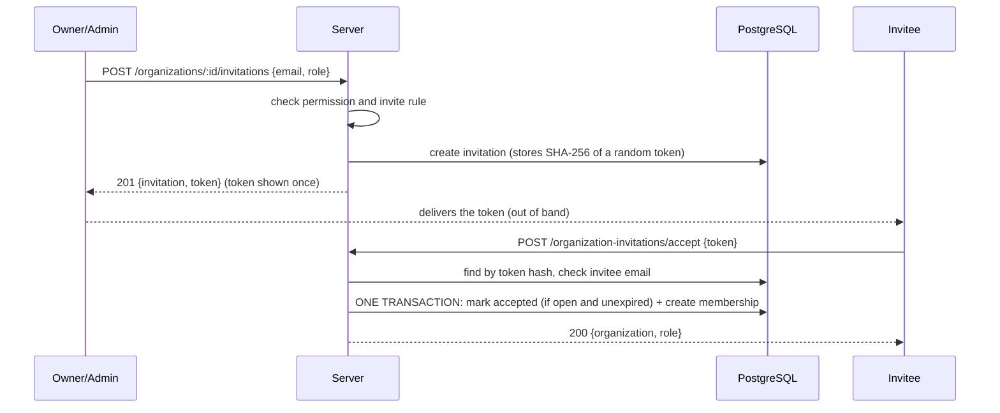

# Organizations & Membership

Official documentation for the organizations feature of `backend-demo`: creating organizations, inviting people, and managing members with organization-level roles.

- **Specification:** [`docs/feature-contracts/20261001103000-organizations.md`](../docs/feature-contracts/20261001103000-organizations.md) is the agreed feature contract this implementation follows. This document describes what was built and how to use and operate it.
- **Customers:** organization-scoped customers reuse this membership check and permission policy. See [customers.md](customers.md). Leads do the same: see [leads.md](leads.md).
- **Builds on:** [Authentication & Authorisation](authentication-and-authorisation.md). Nothing in that feature changed: same tokens, same envelope, same error mechanism.
- **Status:** implemented; 117 of the project's 232 automated tests cover it.

## Contents

1. [Concepts](#1-concepts)
2. [Decisions](#2-decisions)
3. [Roles, permissions and rules](#3-roles-permissions-and-rules)
4. [Data model](#4-data-model)
5. [Flows](#5-flows)
6. [API reference](#6-api-reference)
7. [Error codes](#7-error-codes)
8. [Security model and known limits](#8-security-model-and-known-limits)
9. [Architecture and where things live](#9-architecture-and-where-things-live)
10. [Migration and operations](#10-migration-and-operations)
11. [Logging](#11-logging)
12. [Tests](#12-tests)

---

## 1. Concepts

Authentication answers *who are you?* Organizations answer *which tenant are you acting in, and with what position there?*

```
User  ──(many)──  OrganizationMembership  ──(many)──  Organization
                         │
                         └─ role: OWNER | ADMIN | MEMBER
```

| Level | Where it lives | Values | Enforced by |
|---|---|---|---|
| Platform role | `User.role`, and the access token | `USER`, `ADMIN` | `authorize()` |
| Organization role | `OrganizationMembership.role`, **database only** | `OWNER`, `ADMIN`, `MEMBER` | `requireOrganizationMembership()` and `requireOrganizationPermission()` |

The two are independent. One user can be `OWNER` of one organization, `MEMBER` of another, and have no relationship with a third. A platform `ADMIN` has **no** special access to organizations (D10).

The JWT is unchanged: it never contains an organization id or an organization role.

---

## 2. Decisions

| # | Decision | Consequence |
|---|---|---|
| **D5** | Organization authorization reads the caller's membership from the database on every organization request. | One indexed read per request. Removals and role changes apply on the **next request**, not after the 15-minute access-token window of D1. |
| **D6** | One `OWNER` per organization, for its whole life. No transfer, no leaving, `OWNER` can never be assigned. | Nobody can remove or demote the owner. Backed by a partial unique index, not only by code. |
| **D7** | An invitation is delivered by returning its raw token **once** to the inviter. No email is sent. | No mail infrastructure. Only the token's SHA-256 hash is stored, so a lost token means a new invitation. |
| **D8** | Only permissions that have an endpoint exist. `member:update_role` is `OWNER`-only. | No `organization:update` or `organization:delete` yet. |
| **D9** | A non-member gets `404 ORGANIZATION_NOT_FOUND`, never `403`. | Organization ids cannot be probed to learn which exist. `403` goes only to members who lack a permission. |
| **D10** | A platform `ADMIN` gets no special access to organizations. | Platform role and organization role stay independent. |

---

## 3. Roles, permissions and rules

### Permissions

| Permission | OWNER | ADMIN | MEMBER |
|---|---|---|---|
| `organization:read` | ✅ | ✅ | ✅ |
| `member:read` | ✅ | ✅ | ✅ |
| `member:invite` | ✅ | ✅ | ❌ |
| `member:remove` | ✅ | ✅ | ❌ |
| `member:update_role` | ✅ | ❌ | ❌ |

The role-to-permission map is plain code in `src/domain/policies/OrganizationPermissions.ts`. There is no database-configurable RBAC.

### Rank rules

Rank is `OWNER > ADMIN > MEMBER`. A permission is necessary but not sufficient:

| Action | Rule |
|---|---|
| Invite | `OWNER` may invite `ADMIN` or `MEMBER`. `ADMIN` may invite `MEMBER` only. `OWNER` can never be invited. |
| Remove | The target must be a member. The `OWNER` can never be removed, by anyone, including themselves. The actor must strictly outrank the target, so `OWNER` removes `ADMIN`/`MEMBER` and `ADMIN` removes `MEMBER` only. |
| Change role | `OWNER` only. The target's role can become `ADMIN` or `MEMBER`; never `OWNER`, and the `OWNER`'s own role cannot change. Setting the role someone already has succeeds as a no-op. |
| Leave | Not possible in v1. `ADMIN` and `MEMBER` fail the "outrank" rule when targeting themselves. |

### Invitations

- Expire **7 days** after creation. The token is 32 random bytes, base64url.
- At most one **open** (unaccepted, unexpired) invitation per organization and email. Inviting again while one is open fails; once it has expired, inviting again replaces it.
- Inviting someone who is already a member fails.
- The email is lowercased. Inviting does **not** create a user.
- **Accepting** requires the caller's account email to equal the invited email.

---

## 4. Data model

Defined in `prisma/schema.prisma`; created by migration `20261001110000_add_organizations`. `User` gains two relations and no columns.

### `Organization`

| Column | Notes |
|---|---|
| `id` | UUID primary key. Used in URLs. |
| `name` | Trimmed, inner whitespace collapsed, 2–100 characters |
| `slug` | **Unique.** Server-generated from the name; never client-supplied. |
| `createdAt`, `updatedAt` | |

Slug: lowercase ASCII letters, digits and single hyphens, at most 48 characters, `org` if nothing is left. If taken, a `-` plus 4 random hex characters is appended (up to 5 retries).

### `OrganizationMembership`

| Column | Notes |
|---|---|
| `id` | UUID primary key |
| `organizationId`, `userId` | Foreign keys, `ON DELETE CASCADE` |
| `role` | `OWNER`, `ADMIN` or `MEMBER` |
| `createdAt`, `updatedAt` | |

- **Unique** `(organizationId, userId)`: one membership per user per organization.
- **Partial unique** `(organizationId) WHERE role = 'OWNER'`: one owner per organization (D6).
- Index on `userId`.

### `OrganizationInvitation`

| Column | Notes |
|---|---|
| `id` | UUID primary key |
| `organizationId` | Foreign key, `ON DELETE CASCADE` |
| `email` | Lowercased |
| `role` | `ADMIN` or `MEMBER` in practice |
| `tokenHash` | **Unique.** SHA-256 of the token. The token itself is never stored. |
| `expiresAt` | |
| `acceptedAt` | Null until accepted |
| `invitedBy` | Foreign key to `User`, `ON DELETE CASCADE` |
| `createdAt` | |

- **Partial unique** `(organizationId, email) WHERE acceptedAt IS NULL`: one open invitation per email. Expired rows are deleted by `create` in the same transaction before inserting, so they do not block a re-invite.
- Indexes on `organizationId` and `email`.

The two partial indexes are hand-written SQL at the end of the migration, because Prisma cannot express them. Prisma ignores them when diffing, so future `migrate dev` runs do not try to drop them.

---

## 5. Flows

### Create an organization

`POST /organizations` → validate name → build slug → **one transaction:** insert the organization and an `OWNER` membership for the caller. If the slug was taken by a concurrent request the transaction rolls back and the use case retries with a suffix.

### Invite and accept



Order of checks on accept: unknown or already-accepted token → `INVALID_INVITATION`; caller's email differs → `INVALID_INVITATION` (so a token holder who is not the invitee cannot even learn that it expired); expired → `INVITATION_EXPIRED`; already a member → `MEMBERSHIP_ALREADY_EXISTS`. If two accepts race, the conditional update (`acceptedAt IS NULL AND expiresAt > now`) lets exactly one win; the other gets `INVALID_INVITATION`.

### Organization-scoped request

```
Authorization: Bearer <access token>
        ↓ authenticate()                          verify JWT → req.user
        ↓ requireOrganizationMembership()         validate :organizationId (UUID),
        │                                         look up membership in the DB
        │                                         none → 404 ORGANIZATION_NOT_FOUND
        ↓ requireOrganizationPermission(perm)     role lacks it → 403 INSUFFICIENT_ORGANIZATION_PERMISSION
        ↓ controller → use case (rank rules)
```

The `:organizationId` in the path is **never trusted**: it only names the organization whose membership is looked up for the authenticated user.

---

## 6. API reference

Base path `/api/v1`. Every route requires `Authorization: Bearer <accessToken>`, uses the standard [response envelope](authentication-and-authorisation.md#61-response-envelope), and can additionally fail with `UNAUTHORIZED`, `INVALID_ACCESS_TOKEN` or `ACCESS_TOKEN_EXPIRED` (401). Path ids must be UUIDs, otherwise `400 VALIDATION_ERROR` with the parameter name in `details`.

| Method | Path | Needs | Purpose |
|---|---|---|---|
| POST | `/organizations` | any user | Create an organization; caller becomes `OWNER` |
| GET | `/organizations` | any user | The caller's organizations with their role |
| GET | `/organizations/:organizationId` | `organization:read` | One organization |
| POST | `/organizations/:organizationId/invitations` | `member:invite` | Invite someone |
| GET | `/organizations/:organizationId/members` | `member:read` | List members |
| PATCH | `/organizations/:organizationId/members/:userId` | `member:update_role` | Change a member's role |
| DELETE | `/organizations/:organizationId/members/:userId` | `member:remove` | Remove a member |
| POST | `/organization-invitations/accept` | any user | Accept an invitation |

### `POST /organizations`

Body: `{ "name": "Acme Technologies" }`.

**201**, message `Organization created successfully.`

```json
"data": { "organization": { "id": "uuid", "name": "Acme Technologies", "slug": "acme-technologies", "role": "OWNER" } }
```

Errors: `400 VALIDATION_ERROR`.

### `GET /organizations`

**200**, message `Organizations retrieved successfully.` Oldest membership first, not paginated.

```json
"data": { "organizations": [ { "id": "uuid", "name": "...", "slug": "...", "role": "MEMBER" } ] }
```

### `GET /organizations/:organizationId`

**200**, message `Organization retrieved successfully.` `role` is the caller's role there.

```json
"data": { "organization": { "id": "uuid", "name": "...", "slug": "...", "role": "MEMBER", "createdAt": "ISO-8601" } }
```

Errors: `400 VALIDATION_ERROR`, `404 ORGANIZATION_NOT_FOUND`.

### `POST /organizations/:organizationId/invitations`

Body: `{ "email": "new@example.com", "role": "MEMBER" }`. `role` is `ADMIN` or `MEMBER` and defaults to `MEMBER`; `OWNER` is a validation error.

**201**, message `Invitation created successfully.`

```json
"data": {
  "invitation": { "id": "uuid", "email": "new@example.com", "role": "MEMBER", "expiresAt": "ISO-8601" },
  "token": "<raw token, shown once>"
}
```

**Keep the token:** it cannot be retrieved later. Pass it to the invitee (for example in a link your app builds).

Errors: `400 VALIDATION_ERROR`, `404 ORGANIZATION_NOT_FOUND`, `403 INSUFFICIENT_ORGANIZATION_PERMISSION`, `409 MEMBERSHIP_ALREADY_EXISTS`, `409 INVITATION_ALREADY_EXISTS`.

### `GET /organizations/:organizationId/members`

**200**, message `Members retrieved successfully.` Oldest membership first, not paginated.

```json
"data": { "members": [ { "userId": "uuid", "name": "...", "email": "...", "role": "OWNER", "joinedAt": "ISO-8601" } ] }
```

Errors: `400 VALIDATION_ERROR`, `404 ORGANIZATION_NOT_FOUND`.

### `PATCH /organizations/:organizationId/members/:userId`

Body: `{ "role": "ADMIN" }` (`ADMIN` or `MEMBER`).

**200**, message `Member role updated successfully.`

```json
"data": { "member": { "userId": "uuid", "role": "ADMIN" } }
```

Errors: `400 VALIDATION_ERROR`, `404 ORGANIZATION_NOT_FOUND`, `403 INSUFFICIENT_ORGANIZATION_PERMISSION`, `404 MEMBERSHIP_NOT_FOUND`, `403 CANNOT_CHANGE_OWNER_ROLE`.

### `DELETE /organizations/:organizationId/members/:userId`

**200**, message `Member removed successfully.`, `"data": null`.

Errors: `400 VALIDATION_ERROR`, `404 ORGANIZATION_NOT_FOUND`, `403 INSUFFICIENT_ORGANIZATION_PERMISSION`, `404 MEMBERSHIP_NOT_FOUND`, `403 CANNOT_REMOVE_OWNER`.

### `POST /organization-invitations/accept`

Body: `{ "token": "<raw token>" }`. There is no organization in the path: the caller is not a member yet.

**200**, message `Invitation accepted successfully.`

```json
"data": { "organization": { "id": "uuid", "name": "...", "slug": "..." }, "role": "MEMBER" }
```

Errors: `400 VALIDATION_ERROR`, `400 INVALID_INVITATION`, `410 INVITATION_EXPIRED`, `409 MEMBERSHIP_ALREADY_EXISTS`.

### Permissions at a glance

| Action | Non-member | MEMBER | ADMIN | OWNER |
|---|---|---|---|---|
| Create organization | ✅ | ✅ | ✅ | ✅ |
| List own organizations | ✅ | ✅ | ✅ | ✅ |
| Read organization, list members | ❌ (404) | ✅ | ✅ | ✅ |
| Invite `MEMBER` | ❌ (404) | ❌ | ✅ | ✅ |
| Invite `ADMIN` | ❌ (404) | ❌ | ❌ | ✅ |
| Remove `MEMBER` | ❌ (404) | ❌ | ✅ | ✅ |
| Remove `ADMIN` | ❌ (404) | ❌ | ❌ | ✅ |
| Remove / demote the `OWNER` | ❌ | ❌ | ❌ | ❌ |
| Change a member's role | ❌ (404) | ❌ | ❌ | ✅ |
| Accept an invitation | ✅ (invited email only) | | | |

---

## 7. Error codes

New codes (the full list is in [authentication-and-authorisation.md, section 7](authentication-and-authorisation.md#7-error-codes)):

| Code | HTTP | When |
|---|---|---|
| `ORGANIZATION_NOT_FOUND` | 404 | The organization does not exist **or the caller is not a member** |
| `INSUFFICIENT_ORGANIZATION_PERMISSION` | 403 | A member lacks the permission, or does not outrank the target or the requested role |
| `MEMBERSHIP_NOT_FOUND` | 404 | The target user is not a member |
| `MEMBERSHIP_ALREADY_EXISTS` | 409 | Inviting or accepting for someone who is already a member |
| `CANNOT_REMOVE_OWNER` | 403 | Removing the `OWNER`, including self-removal by the `OWNER` |
| `CANNOT_CHANGE_OWNER_ROLE` | 403 | Changing the `OWNER`'s role |
| `INVITATION_ALREADY_EXISTS` | 409 | An open invitation for that email already exists |
| `INVITATION_EXPIRED` | 410 | The right user presented a valid token past its expiry; ask for a new invitation |
| `INVALID_INVITATION` | 400 | Unknown token, already accepted, or the caller's email is not the invited one |

Clients should branch on `error.code`, never on `message`. Suggested handling: `ORGANIZATION_NOT_FOUND` means treat the organization as gone; `INSUFFICIENT_ORGANIZATION_PERMISSION` means hide or disable the action; `INVITATION_EXPIRED` means ask the inviter for a new invitation.

---

## 8. Security model and known limits

### What is in place

- **Tenant isolation:** every organization-scoped route resolves the caller's membership from the database first. A non-member's response is identical to the response for an organization that does not exist.
- **No organization data in the JWT**, so membership changes are not delayed by token lifetime (D5).
- **Invitation tokens:** 256 bits of randomness, stored only as SHA-256, shown once, bound to one email, single-use, expiring.
- **Guarded writes:** accepting an invitation, changing a role and removing a member are single conditional statements or transactions, so concurrent requests cannot both win and an `OWNER` row can never be changed or removed, even by a racing request.
- **One owner** is enforced by the database, not only by code.
- **Logs never contain** invitation tokens or their hashes.

### Known limits

| Limit | Impact | Next step |
|---|---|---|
| **No rate limiting** (the existing project-wide gap) | Invitation creation and acceptance can be hammered | Add limits per user and per IP |
| **No email delivery (D7)** | The inviter must pass the token on | Add a mail sender behind an interface |
| **Invitations cannot be revoked or listed** | A mistaken invitation stays open until it expires or is accepted | Add revoke and list endpoints |
| **Member emails are visible to all members** | Any member can see every member's email | Restrict by role if that is too open |
| **Membership existence is visible to inviters** | `MEMBERSHIP_ALREADY_EXISTS` tells an inviter that an email belongs to a member | Acceptable: inviters can already list members |
| **No pagination** on lists | Large organizations return everything | Add pagination |
| **Single owner, no transfer or leaving (D6)** | An owner cannot hand over or leave | A separate ownership-transfer feature |
| **An actor demoted mid-request** | A request already past its permission check finishes using the role it was checked with | Negligible; the next request sees the new role |

---

## 9. Architecture and where things live

Same layering as authentication: `route → controller → use case → interface → infrastructure`. `src/domain` and `src/application` import no Express, Prisma, JWT or bcrypt.

| Layer | Files |
|---|---|
| Domain | `enums/OrganizationRole`, `policies/OrganizationPermissions` (permission map, rank rules), `entities/Organization*`, `repositories/Organization*Repository` |
| Application | `dto/organization/` (Zod request schemas, response mappers), `use-cases/organization/` (one class per operation: `CreateOrganization`, `ListUserOrganizations`, `GetOrganization`, `InviteOrganizationMember`, `AcceptOrganizationInvitation`, `ListOrganizationMembers`, `UpdateOrganizationMemberRole`, `RemoveOrganizationMember`, plus `slugify`) |
| Infrastructure | `database/repositories/PrismaOrganization{,Membership,Invitation}Repository`, `http/controllers/OrganizationController` |
| App | `middleware/organization.middleware` (`requireOrganizationMembership`, `requireOrganizationPermission`), `routes.ts`, `container.ts`, `types/express.d.ts` (`req.organizationMembership`) |

Repository operations that must be atomic are single methods, so use cases never coordinate transactions:

| Method | Guarantee |
|---|---|
| `OrganizationRepository.createWithOwner` | Organization and `OWNER` membership are created together or not at all; returns `null` for a taken slug |
| `OrganizationInvitationRepository.create` | Expired invitations for that email are replaced; an open one is rejected |
| `OrganizationInvitationRepository.accept` | Marking accepted and creating the membership are one transaction, guarded by `acceptedAt IS NULL AND expiresAt > now` |
| `OrganizationMembershipRepository.updateRole`, `remove` | Never touch an `OWNER` row; return `false` if nothing matched |

---

## 10. Migration and operations

```bash
npx prisma migrate deploy      # applies 20261001110000_add_organizations
```

No seed is needed. The migration is purely additive.

**Creating migrations when your database user cannot create databases.** `prisma migrate dev` needs a shadow database and fails with `P3014` if the user lacks the `CREATEDB` privilege. This migration was generated without one:

```bash
git show HEAD:prisma/schema.prisma > /tmp/schema.before.prisma    # the schema as last committed
npx prisma migrate diff --from-schema /tmp/schema.before.prisma --to-schema prisma/schema.prisma --script
```

Put the output in `prisma/migrations/<timestamp>_<name>/migration.sql`, review it, and commit it. Apply it with `migrate deploy` as usual.

---

## 11. Logging

One JSON line per event, like the authentication events.

| Event | Fields |
|---|---|
| `organization_created` | `userId`, `organizationId` |
| `member_invited` | `userId`, `organizationId`, `invitationId`, `role` |
| `invitation_accepted` | `userId`, `organizationId`, `role` |
| `invitation_accept_failed` | `userId`, `reason` (an error code) |
| `member_role_changed` | `userId`, `organizationId`, `targetUserId`, `oldRole`, `newRole` |
| `member_removed` | `userId`, `organizationId`, `targetUserId`, `removedRole` |

Invitation tokens and their hashes are never logged.

---

## 12. Tests

117 tests in 4 files, part of the project's 232.

| File | What it covers |
|---|---|
| `tests/unit/organization-policy.test.ts` | The permission map, rank rules and `slugify` |
| `tests/unit/organizations.test.ts` | Every use case against in-memory fakes |
| `tests/integration/organizations.http.test.ts` | The real app and database: full lifecycle, tenant isolation, platform `ADMIN` gets nothing, changes apply on the next request with the same token, the permission matrix, invitations, validation, authentication, and that the JWT stays free of organization data |
| `tests/integration/organization-repositories.test.ts` | The real SQL guards: atomic `createWithOwner`, both partial unique indexes, one winner among simultaneous accepts, expiry, rollback on a duplicate membership, and `OWNER` rows untouchable by `updateRole` and `remove` |

Each database protection was checked by removing it and confirming its test fails: the two conditions in `accept` (`acceptedAt IS NULL`, `expiresAt > now`), the invitation replacement, both `OWNER` conditions, the transaction in `createWithOwner`, and each partial unique index.
